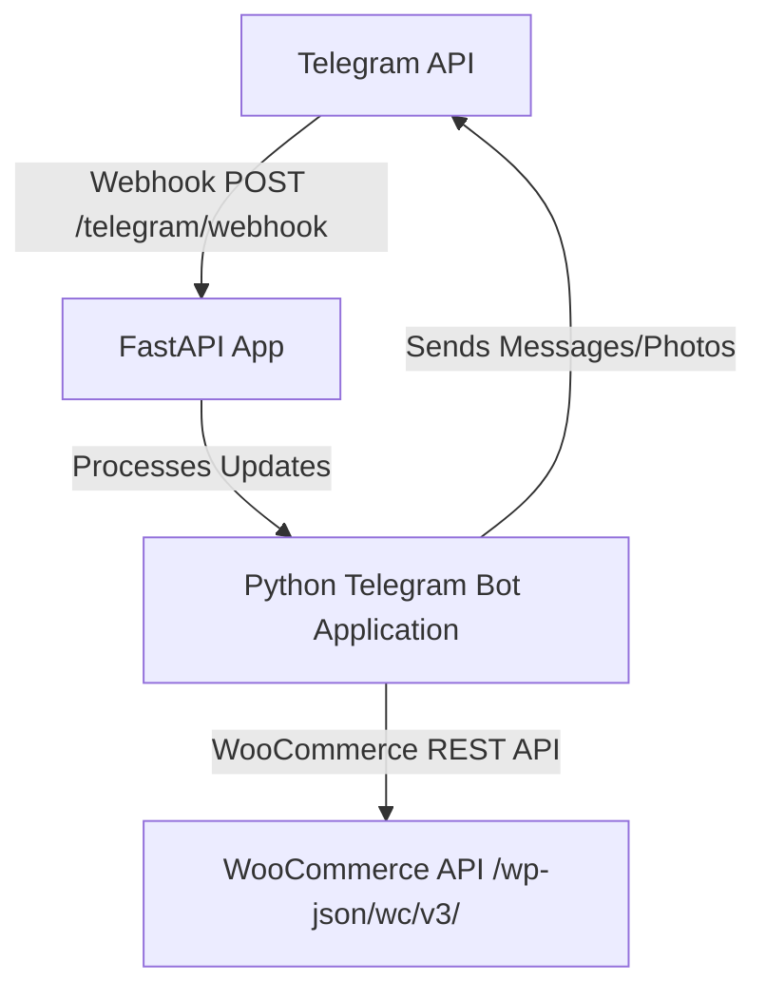

# DeenCommerce Telegram Bot

## Workflow

1. Read `main.py` first. Most application behavior lives in this single file.
2. Preserve the FastAPI webhook architecture. Do not switch to polling unless the user asks for local-only testing.
3. Keep WooCommerce access read-only unless the user explicitly asks for cart, checkout, or order mutation features.
4. Update `.env.example`, `README.md`, and `DEPLOY.md` whenever required environment variables or deployment commands change.
5. Validate with `python -m py_compile main.py` and `git diff --check`.

## Security Requirements

- Require `TELEGRAM_WEBHOOK_SECRET` and validate it against `X-Telegram-Bot-Api-Secret-Token`.
- Never log bot tokens, WooCommerce secrets, full webhook payloads, or customer personal data.
- Do not reveal orders from email alone. Require order number plus billing email at minimum.
- Escape dynamic text before using Telegram Markdown.

## WooCommerce Rules

- Product categories come from `products/categories`. Filter to top-level categories only (`parent == 0`) and sort by `menu_order`.
- Category product lists use the `category` query parameter on `products`.
- Stock display must prefer `stock_status`.
- Show exact quantity only when `manage_stock` is true and `stock_quantity` is not null.
- For variable products, expect stock to depend on product or variation settings.

## Telegram UI Rules

- Keep callback data short and deterministic.
- Use paginated lists for products to avoid Telegram message length and button limits.
- Add a Back button on every submenu.
- Clear pending user input state when returning to the main menu.
- Support commands `/start` (personalizes greeting with `Assalamu Alaikum {name}`), `/help` (FAQ support options), `/browse` (top-level categories), `/search` (direct/prompted product searches), and `/ask` (AI assistant).
- Dynamically synchronize bot commands on startup with `set_my_commands` by parsing active CommandHandlers.
- Attach `🗑️ Reset Chat` (`reset_ai_chat`) and `← Back to Menu` (`start_menu`) inline buttons to final AI responses for continuous chat UI/UX.
- Add `View on Website` / `View Category on Website` buttons on products, category product lists, and search results.
- Implement/maintain multi-provider AI fallback logic for RAG with `max_tokens=1000` limits for OpenAI-compatible clients.
